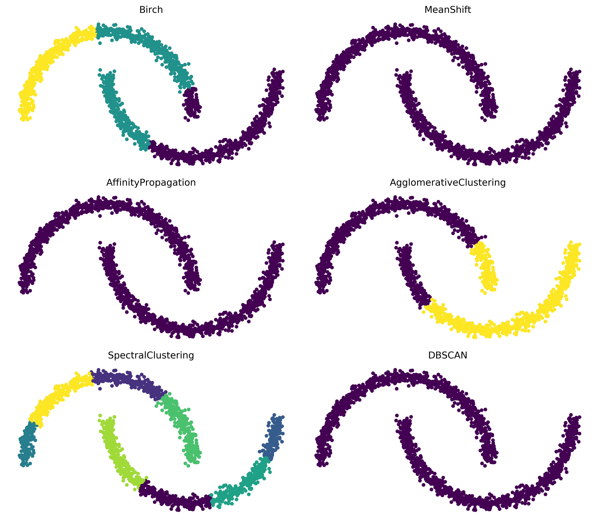
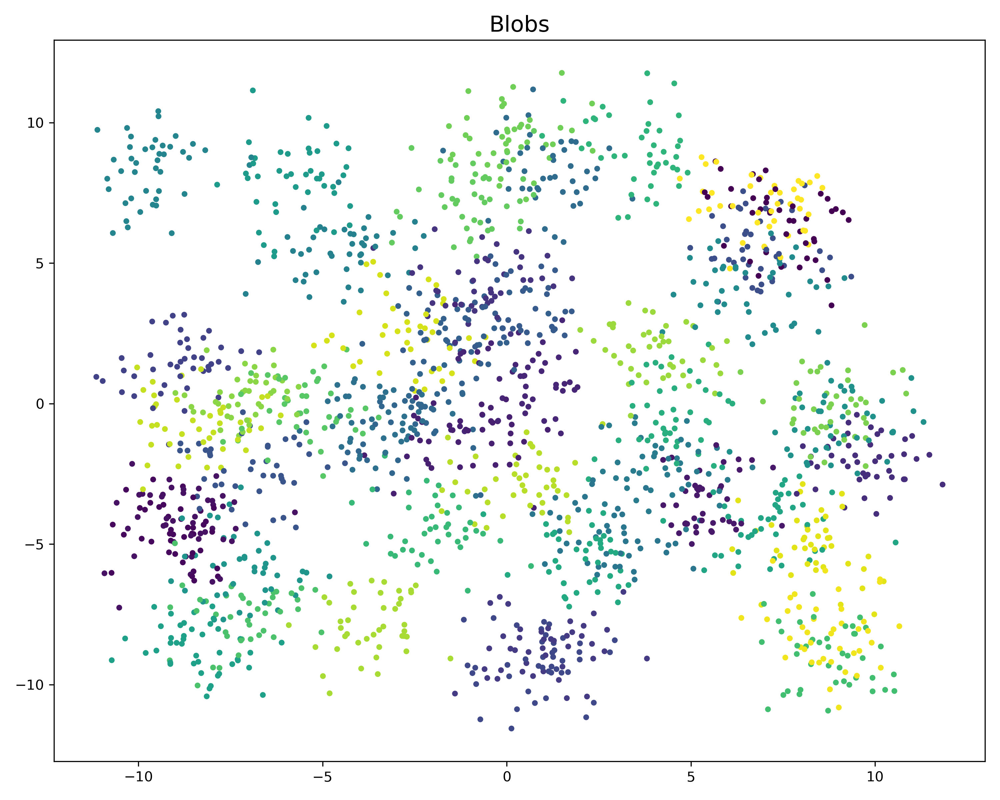
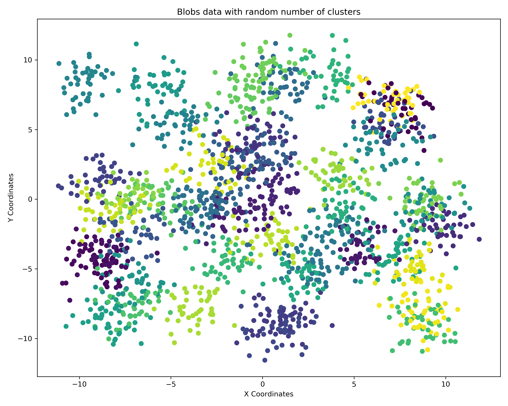
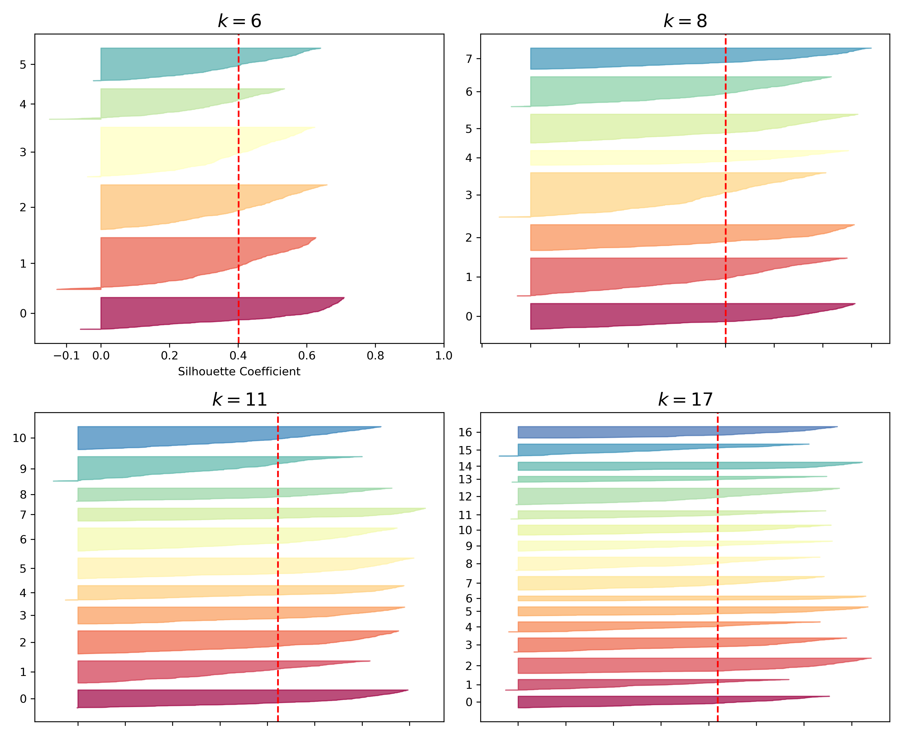
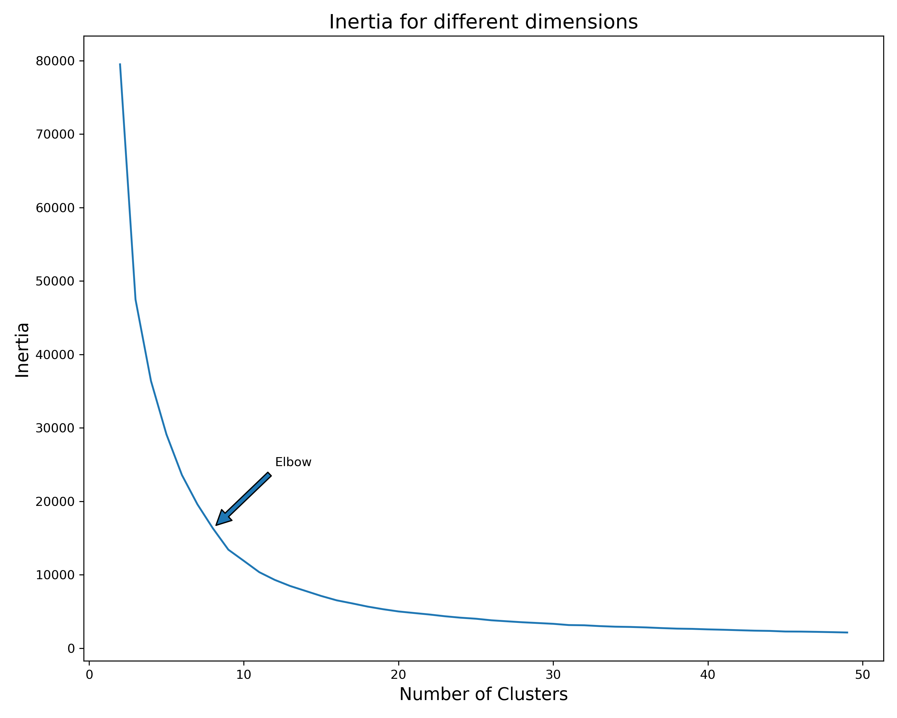
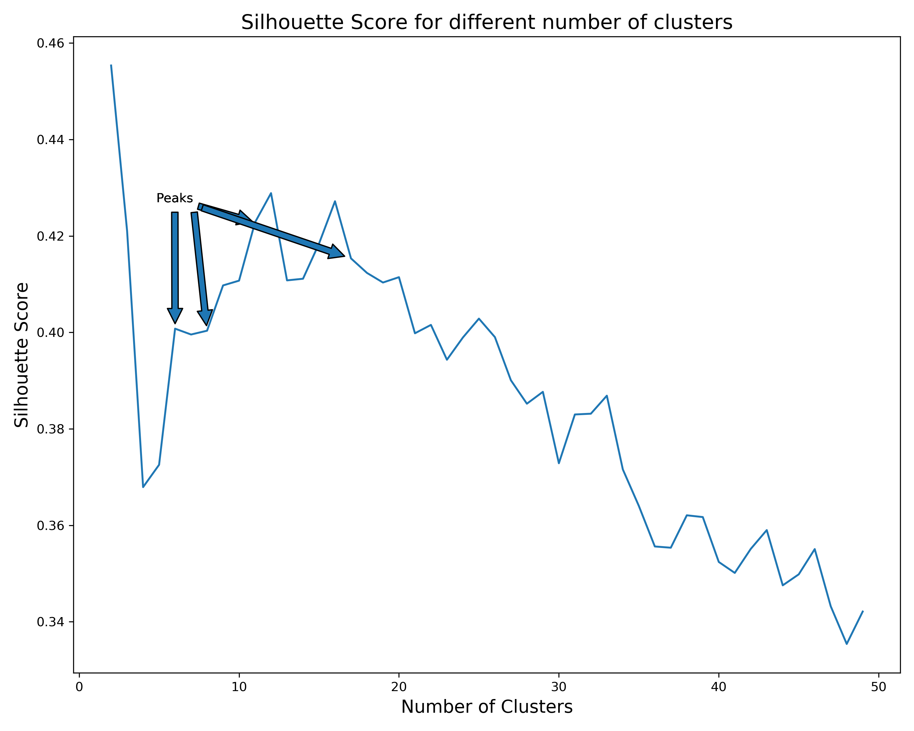
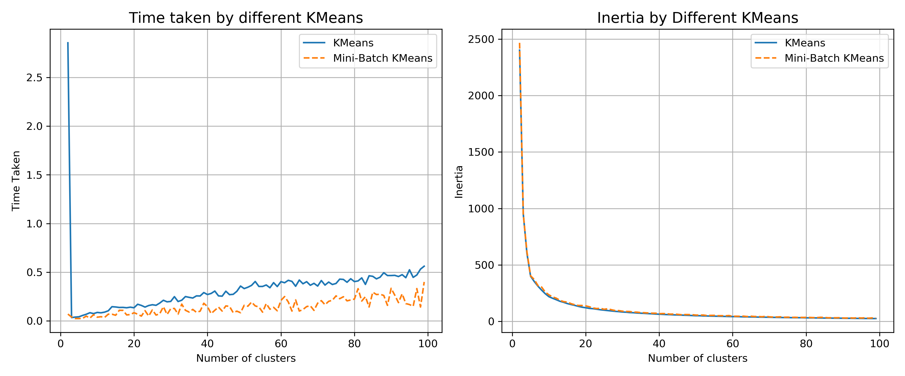
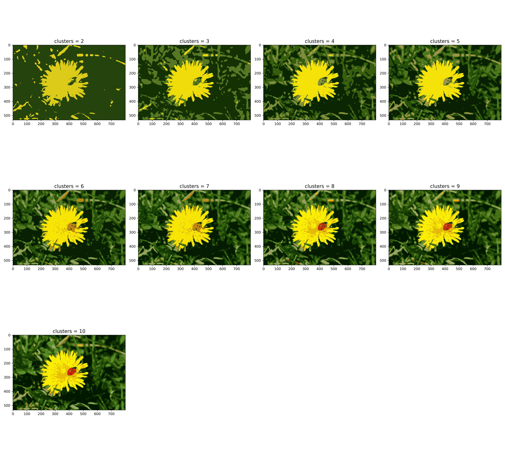
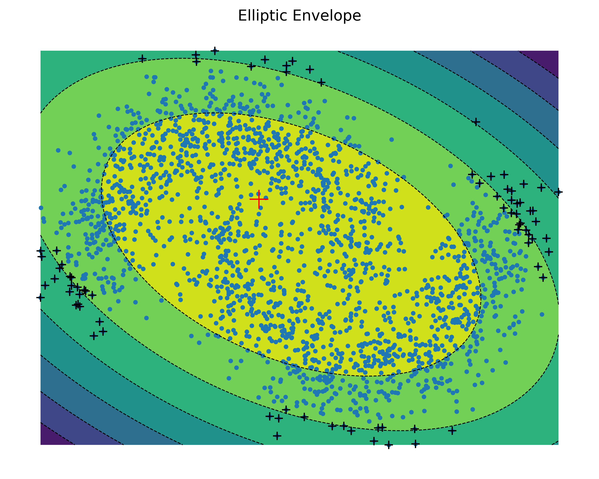

# unsupervised-learning-notebook

### Description
*This notebook contains the implementation of many unsupervised algorithms - especially clustering algorithms. This notebook was heaviliy inspired and guided by * 

### Table of Contents

### Algorithms Used
* Clustering 
  - KMeans
  - MiniBatchKMeans
* Semi-Supervised 
  - KMeans
  - Percentile semi-supervised learning
* Grid Search CV
* Image Segmentation 
* Semantic Clustering 
* Other Clustering
  - Spectral Clustering RBF
  - Spectral Clustering Nearest Neighbours
  - Birch
  - MeanShift
  - Affinity Propagation
  - Aggkineratice Clustering 
  - Spectral Clustering 
  - DBSCAN
* Outlier Detection 
  - DBSCAN for outlier 
* Bayesian Mixtures
* Elliptic Clustering 

### In Actions
<section style="display:flex; flex-direction:column;'">
  <article>
       <h4>All Clustering<h4/>
      
  <article/>
   
   <article>
       <h4>KMeans<h4/>
      
  <article/>
         
  <article>
       <h4>KMeans with random number of clusters<h4/>
      
  <article/>     
         
   <article>
       <h4>Silhouette Diagrams for KMeans<h4/>
      
  <article/>
         
   <article>
       <h4>Inertia for Different Dimensions<h4/>
      
  <article/>
         
     <article>
       <h4>Silhouete Score different number of clusters<h4/>
      
  <article/>
         
   <article>
       <h4>All Clustering<h4/>
      
  <article/>   
         
         
  <article>
       <h4>Semantic Clustering<h4/>
      
  <article/>
         
  <article>
       <h4>Elipctic Envelope<h4/>
      
  <article/>
       

         
      
   
<section/>

### Source 
1) GeÌron, Aureìlien. 2019. Hands-on Machine Learning with Scikit-Learn, Keras and TensorFlow: Concepts, Tools, and Techniques to Build Intelligent Systems. 2nd ed. CA 95472: O’Reilly.
